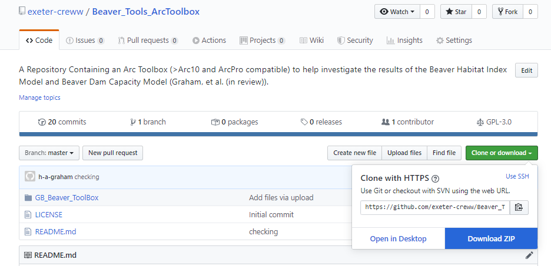
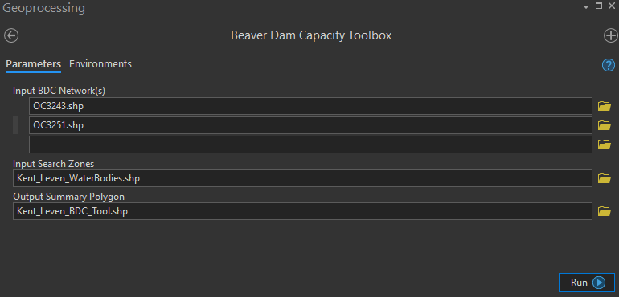

# GB Beaver Tools ArcToolbox
A Repository Containing an Arc Toolbox (>Arc10 and ArcPro compatible) to help investigate the results of the Beaver 
Habitat Index Model and Beaver Dam Capacity Model (Graham, et al. (in review) and Macfarlane, et al. (2015). These tools were developed for the 
Environment Agency and Natural England as part of a national beaver habitat and regional dam capacity modelling project.

#### Model Descriptions
#####The Beaver Habitat index: 
A raster dataset which provides an integer value between 0-5, at a resolution of 5m, which describes the suitability of
the vegetaion/landuse type for beaver forage.

#####Beaver Dam Capacity Model
A vector dataset of a river network that describes the reach scale (~130m) capacity to support dams. Dam capacity is 
provided as 0-30 dams/km.

##Arc Tool Box *(BeaverMod_ToolBox.pyt)*
This repository contains an Arc tool ([*BeaverMod_ToolBox.pyt*](GB_Beaver_ToolBox/BeaverMod_ToolBox.pyt)) box which 
contains 3 tools:

#####1) Beaver Dam Capacity Toolbox ([*BDC_Interp_Script.py*](GB_Beaver_ToolBox/BDC_Interp_Script.py))
Returns summary statistics, for defined search areas, of BDC model results

#####2) Beaver Habitat Toolbox ([*BHI_Interp_Script.py*](GB_Beaver_ToolBox/BHI_Interp_Script.py))
Returns summary statistics, for defined search areas, of BHI model results.

#####3) Beaver Habitat Stand Alone Toolbox ([*BHI_StAl_Script.py*](GB_Beaver_ToolBox/BHI_StAl_Script.py))
Returns summary statistics, for defined search areas, of BHI model results as in te Beaver Habitat Toolbox. However, 
this tool requires the full England BHI dataset to be loaded to disk. it then automatically locates the required raster 
tiles to analyse. Gives the same results as the Beaver Habitat Toolbox but requires no pre-processing of raster data. 
Slightly slower than Beaver Habitat Toolbox.

## Tool Box Demo...

* Download This Repo 
([*https://github.com/exeter-creww/Beaver_Tools_ArcToolbox*](https://github.com/exeter-creww/Beaver_Tools_ArcToolbox)):

* Unzip files in your desired install location.

* Open Arc Pro or Arc GIS 10+, Navigate to Arc Catalogue, Open Toolbox.

* To run the **Beaver Dam Capacity Toolbox**, Select the tool from the Catalogue menu. Enter the 3 
required inputs and click Run:
    * **Input BDC Networks(s)** - select the file path(s) for the BDC networks of interest.
    * **Input Search Zones** - select a path to a user-created polygon feature which defines the areas of interest. The 
    polygon file (.shp for example) may contain multiple features which will all be evaluated individually.
    * **Outout Summary Polygon** The desired save path for the resulting Polgon which contains the BDC summary 
    statistics for each feature/AOI.

    

